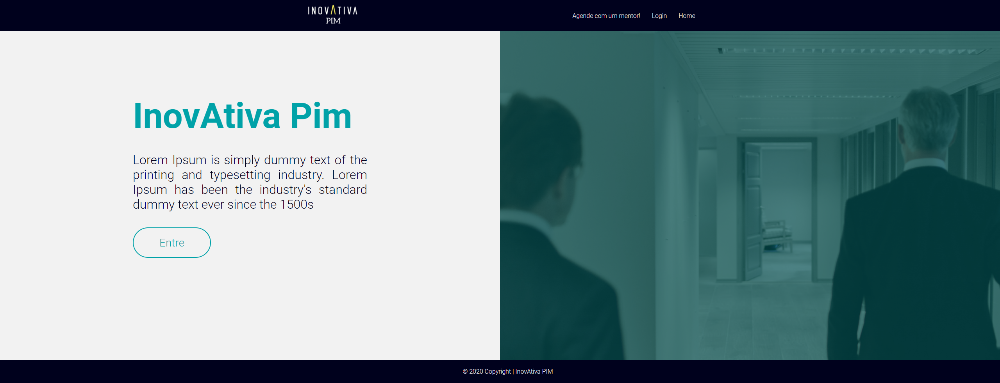

<h1 align="center">
    InovAtiva | Hackathon Mega Hack 5.0
</h1>

  

## 💻 Sobre o projeto e Como Executar:
A inovAtiva foi um projeto elaborado durante o hackathon da Mega Hack 5.0, eu fiquei responsável pela parte do front-end da nossa plataforma de ensino concentrada em gamificação.

## 🚀 Tecnologias Usadas:

- [HTML](https://www.w3schools.com/html/)
- [CSS](https://developer.mozilla.org/pt-BR/docs/Web/CSS)

 ## ℹ️ Resultados:
 

